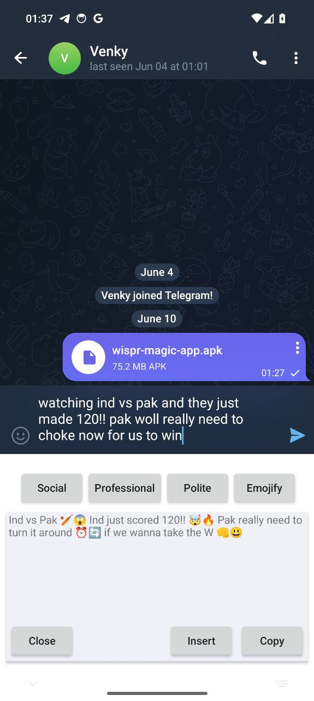
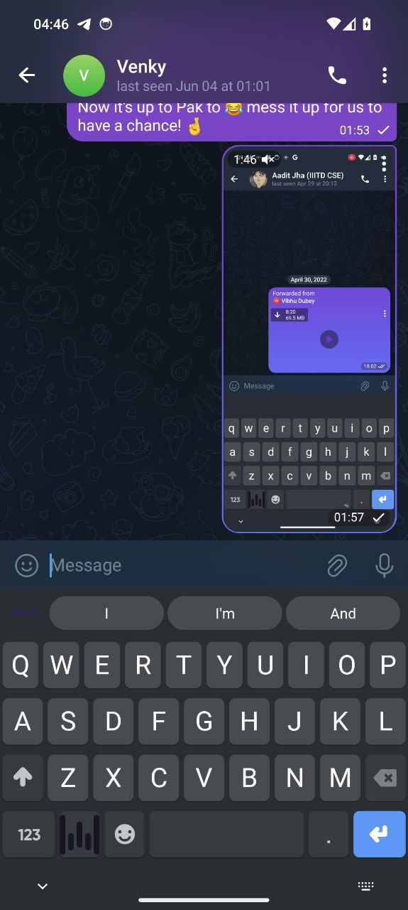

# Wispr-SWE-Challenge

## How to build locally

- Create a secrets.properties file in WisprMagicAndroid/app/ dir with your FLEKSY_LICENSE_KEY, FLEKSY_LICENSE_SECRET, and AUTH_TOKEN for your modal enpoint bearer token
- Update the BASE_URL in network/ToneAssistApiService.kt to your modal endpoint
- Create .env file in the Backend dir with your GROQ_API_KEY
- Build the Android app with Android Studio
- Deploy the backend on modal 
- Enjoy!

### :camera: A Peek into the App

    
    

## ToDo:
- [x] Create a README.md
- [x] Add screenshots
- [x] The app will act as a testing and config changer (settings) 
- [x] Extract the typed text or allow extraction through selection
- [x] Set up a backend to handle the text rephrasing
- [x] add auth to the api
- [ ] voice notes feature (transcribing + llm)
